<h3><h3>
Technology & Frameworks
<ul>
  <li>HTML</li>
  <li>CSS</li>
  <li>JS</li>
  <li>Bootstrap</li>
  <li>Jquery</li>
</ul>

Site Map : https://drive.google.com/file/d/1npVBac_66M0O2sSm7Cl_KxWo2dw5rC2B/view?usp=sharing

Wireframe : https://drive.google.com/file/d/15Y4GvVsZiYhoifH_EWiarY9mWDlsk_ci/view?usp=sharing

Mockup : https://www.figma.com/file/cwrCp2oKl4bj67PRJPWlDa/Mockup?type=design&node-id=0%3A1&mode=design&t=LCnFlPAYT1IFwJrI-1

Deployment 

InfinityFree : http://borrowedskate58.epizy.com 
GitHub Pages : https://github.com/DushanMalind/MyPortfolio.git 

Web POS Using CSS FrameWorks 

Site Map: https://app.diagrams.net/#G1ZBDICxyXWpnhup44ARt0dU4EUteVxPSs

Wire-Frame:https://app.diagrams.net/#G1IPC00swibRmIvM9upjBZq56YXXd844qD

Mockup:https://www.figma.com/file/PwgGkZXXXVQKKWMTpMfATn/Untitled?type=design&node-
id=0-1&t=LG0MIu7MFFAnVJ5e-0

Developed By Dushan Malinda

<h>Desktop View</h3>

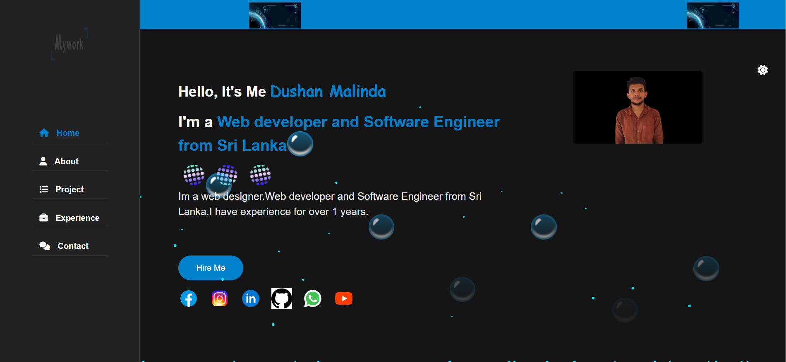
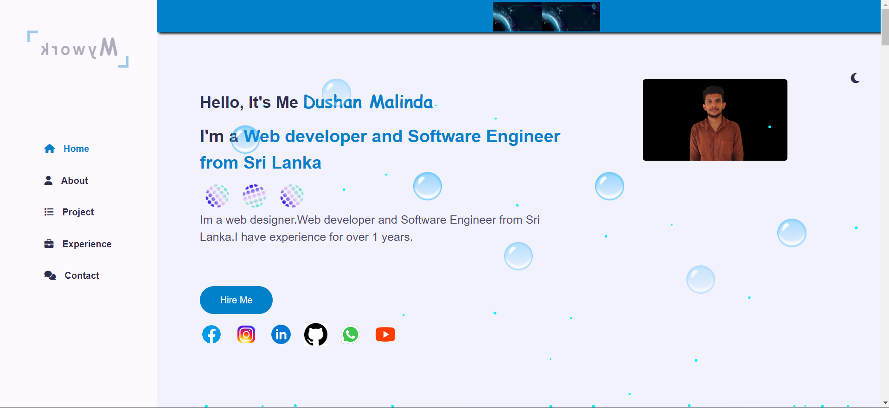
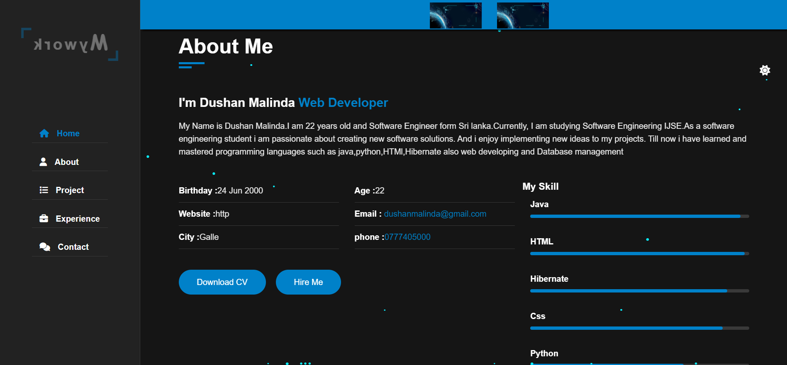
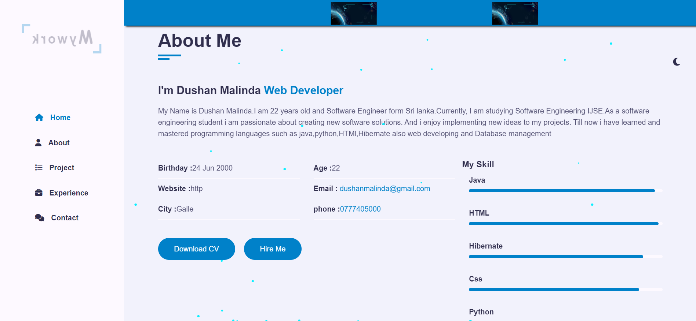
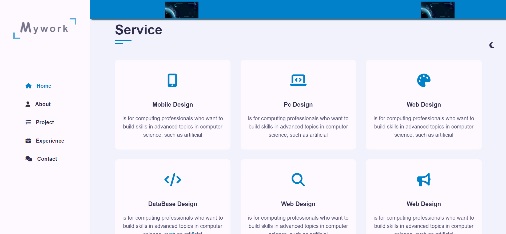
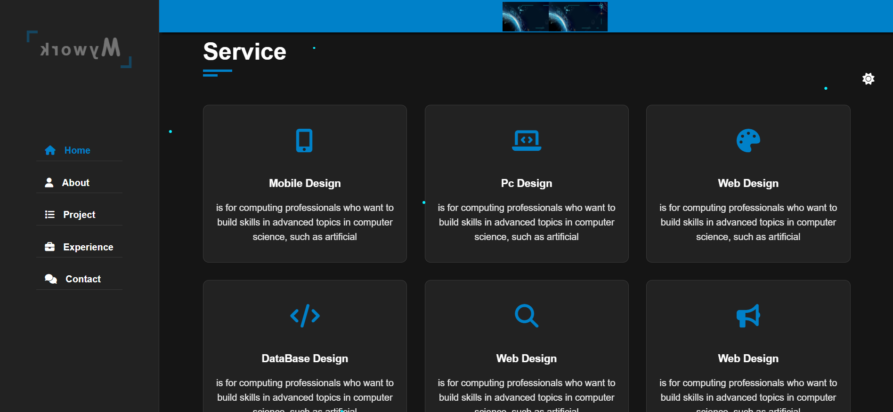
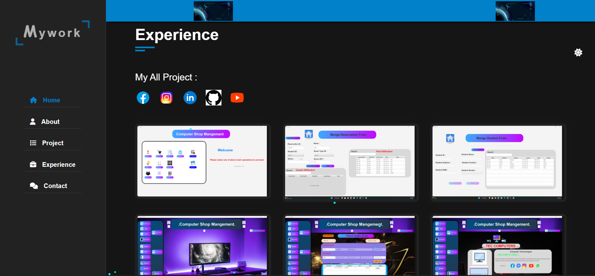
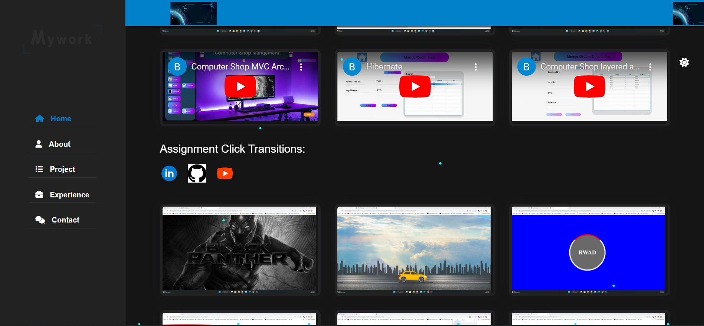
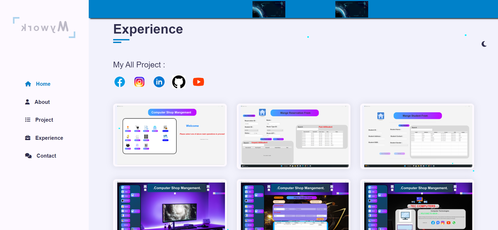
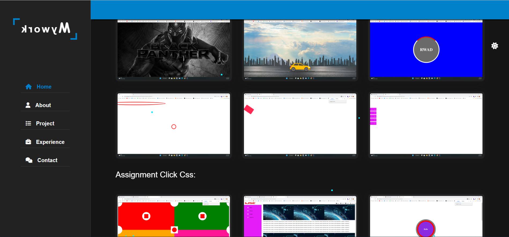
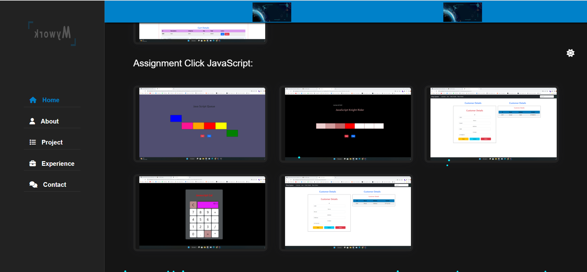
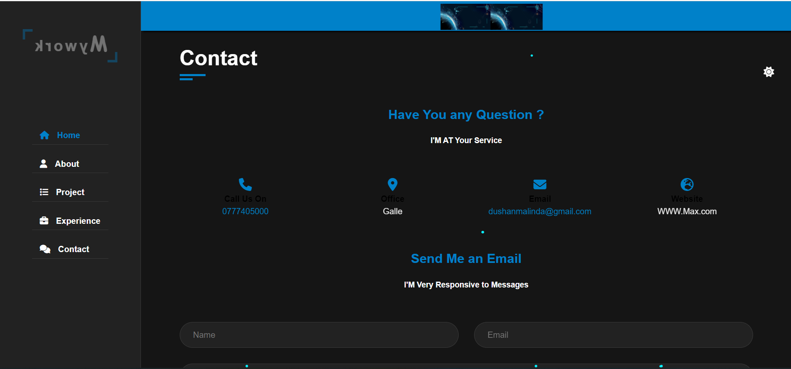